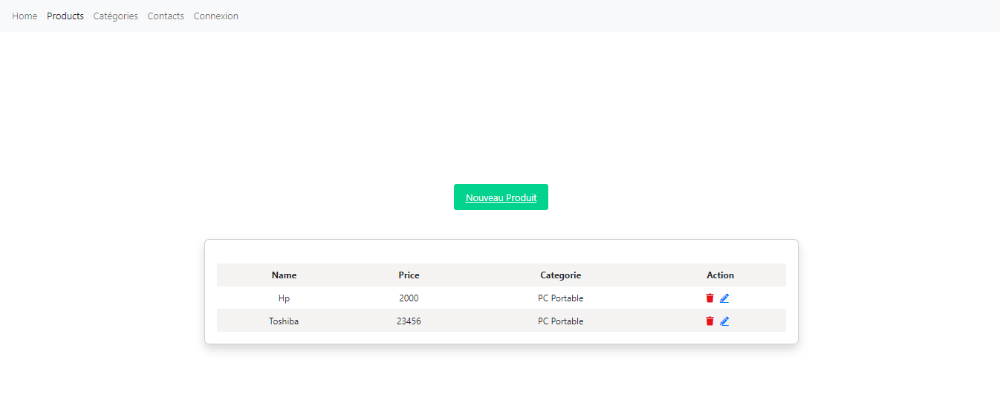
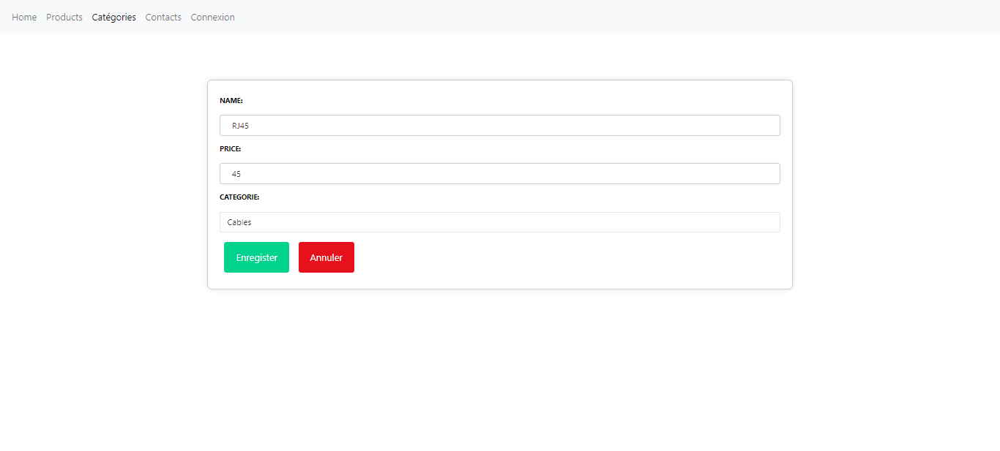

<h1>Site e-commerce</h1>
<h2>Introduction</h2>

Dans le paysage commercial contemporain, la création d'un site e-commerce 
    revêt une importance stratégique incontestable. En réponse à l'évolution numérique, 
    ces plateformes en ligne sont devenues des leviers essentiels pour les entreprises cherchant 
    à prospérer dans un monde de plus en plus connecté. Ce rapport explore les aspects cruciaux de la 
    réalisation d'un site e-commerce, mettant en lumière son rôle pivot dans la transformation digitale des 
    entreprises et son impact sur la croissance économique, la visibilité de la marque, et la satisfaction client. 
    En comprenant les implications de cette démarche, les entreprises peuvent non seulement s'adapter au marché actuel, 
    mais également anticiper les tendances futures du commerce en ligne.

<h2>Technologies utilisées</h2>
<h3>React</h3>
    
React, développé par Facebook, est une bibliothèque JavaScript front-end qui a révolutionné 
        le développement d'interfaces utilisateur interactives et dynamiques. En mettant l'accent sur la 
        création de composants réutilisables, React offre une approche déclarative pour construire des 
        interfaces utilisateur, simplifiant ainsi le processus de développement et améliorant la maintenabilité 
        du code. Grâce à sa virtual DOM, React optimise les mises à jour d'interface utilisateur, assurant des 
        performances élevées pour les applications web complexes.

        
 

<h3>Node.js</h3>

Node.js est un environnement d'exécution JavaScript côté serveur, basé sur le moteur V8 de Google. 
        Il offre une plateforme légère et efficace pour le développement d'applications back-end évolutives. 
        La nature asynchrone de Node.js, associée à son système de gestion des événements, permet le traitement 
        simultané de nombreuses requêtes, améliorant ainsi la réactivité des applications. Node.js est particulièrement 
        adapté aux applications en temps réel, aux API RESTful, et aux microservices, offrant une solution polyvalente pour 
        les besoins de développement back-end.

        
    

<h3>MongoDB</h3>
    
MongoDB, une base de données NoSQL orientée document, se distingue par sa flexibilité et sa scalabilité horizontale. 
        Contrairement aux bases de données relationnelles, MongoDB stocke les données au format JSON-like (BSON), facilitant 
        l'intégration avec des applications JavaScript, notamment celles développées avec Node.js et React. Sa structure de base de données 
        sans schéma fixe permet une adaptation aisée aux besoins changeants des applications, offrant une agilité précieuse dans un environnement 
        de développement dynamique. MongoDB est ainsi un choix populaire pour les applications web modernes nécessitant une gestion efficace des données 
        non structurées.

        
   

<h2>Fonctionnalité</h2>

Cette application permet de :

<ol>

  <li>Ajouter une categorie</li>
  </ul>
  <li>Ajouter un produit en l'associant à une categorie</li>
  </ul>
  <li>Lister les produits</li>
  </ul>
  <li>Editer un produit</li>
  </ul>
  <li>Supprimer un produit</li>
  </ul>
  <li>Navigation des pages grace au navbar</li>
  </ul> 

</ol>

<h2>Guide d'utilisation</h2>

Pour executer le projet dans votre machine.
    Veuillez extraire le projet dans votre machine , ouvrez le terminal. 
     Taper cd backend 
      Puis taper npm start
    Veillez ouvrir un nouveau terminal.
     Taper cd front-end
      Puis cd tp1_react
      Puis taper npm start
  

<h2>Apercu du projet</h2>

Page Home

Page produit qui permet de lister les produits

Page Ajouter un nouveau produit

Page Edit

Ajout categorie

Page nous contacter

Page authentification

